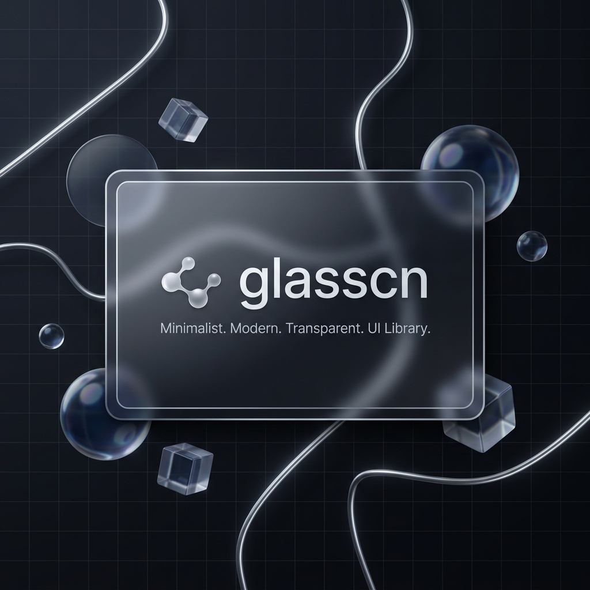

# ✨ glasscn

<p align="center">
  
</p>

> A premium glassmorphic React component library — like [shadcn/ui](https://ui.shadcn.com), but for glass.

[](https://github.com/spideydotjs/glasscn/actions/workflows/ci.yml)
[](https://www.npmjs.com/package/glasscn)
[](LICENSE)

🌐 **Live Preview** → [glasscn.sonusid.in](https://glasscn.sonusid.in)

---

## What is Glasscn?

Glasscn gives you **27+ production-ready glassmorphic UI components** that you copy-paste into your project — no runtime dependency, no black-box package. Every component ships with its own CSS and works with any React setup.

Three glass presets out of the box:

| Preset | Look & Feel |
|:---|:---|
| **Frosted** | Classic satin blur with soft diffusion |
| **Liquid** | Crystal-clear reflections with sharp highlights |
| **Matte** | Heavy frosted overlay with deep saturation |

---

## 🚀 Quick Start

Follow these 4 simple steps to integrate glassmorphism into your application:

### Step 1: Initialize in your project
Run the initialization command at the root of your React/Next.js project:

```bash
npx glasscn init
```

This creates a `glasscn.json` configuration file:
```json
{
  "style": "src/glassify.css",
  "components": "src/components/glassify",
  "utils": "src/lib/utils.ts"
}
```

It also:
- Downloads core tokens (`tokens.css`) and keyframes (`animations.css`) into your components folder.
- Creates the class merging utility `utils.ts` (using `clsx` and `tailwind-merge` if present, or fallback utility).
- Creates `src/glassify.css` with the core styles imported.

### Step 2: Import the styling entrypoint
In your main app entrypoint (e.g., `src/main.tsx`, `src/index.tsx`, or `src/app/layout.tsx`), import the stylesheet:

```typescript
import './glassify.css';
```

### Step 3: Add a component
Use the `add` command to copy component source code directly into your codebase:

```bash
npx glasscn add glass-button
```

This will download:
- `index.tsx` (React component structure)
- `styles.css` (Component-specific glass styling variables)

The CLI automatically rewrites the import paths of the `cn` utility inside `index.tsx` to match your local project and registers the component style inside `src/glassify.css`.

### Step 4: Use the component
Import and use the component inside your React pages:

```tsx
import React from 'react';
import { GlassButton } from './components/glassify/glass-button';

export default function Page() {
  return (
    <div className="flex gap-4 p-8 bg-gradient-to-br from-indigo-900 to-purple-950 min-h-screen items-center justify-center">
      <GlassButton glass="frosted" variant="solid">
        Frosted Button
      </GlassButton>
      <GlassButton glass="liquid" variant="outline">
        Liquid Button
      </GlassButton>
      <GlassButton glass="matte" variant="ghost">
        Matte Button
      </GlassButton>
    </div>
  );
}
```

---

## 🧱 Component Catalog

### 📐 Layout
`glass-card` · `glass-panel` · `glass-navbar` · `glass-sidebar` · `glass-drawer`

### ✍️ Forms & Inputs
`glass-button` · `glass-input` · `glass-textarea` · `glass-select` · `glass-checkbox` · `glass-radio` · `glass-toggle` · `glass-slider`

### 💡 Feedback
`glass-modal` · `glass-tooltip` · `glass-toast` · `glass-alert` · `glass-badge` · `glass-progress`

### 🧭 Navigation
`glass-tabs` · `glass-breadcrumb` · `glass-pagination` · `glass-dropdown-menu`

### 📺 Display
`glass-avatar` · `glass-table` · `glass-accordion` · `glass-calendar`

---

## 🖥️ Interactive Playground

Run the playground locally to preview all components with a live split-pane editor:

```bash
git clone https://github.com/spideydotjs/glasscn.git
cd glasscn
npm install
npm run preview
```

Open [localhost:5173](http://localhost:5173) — toggle glass presets, tweak props, copy code snippets, all in one view.

---

## 📦 Project Structure

```
glasscn/
├── components/           # 27 glassmorphic UI components
│   └── glass-button/
│       ├── index.tsx      # React component
│       └── styles.css     # Scoped styles with CSS variables
├── packages/
│   ├── cli/               # The `glasscn` CLI tool
│   └── preview/           # Vite + React interactive playground
├── lib/
│   ├── tokens.css         # Design tokens & CSS variables
│   ├── animations.css     # Keyframe animations
│   └── utils.ts           # cn() class merger utility
├── registry.json          # Component manifest for the CLI
└── package.json
```

---

## 🤝 Contributing

Contributions are welcome! To add a new component:

1. Create `components/glass-{name}/index.tsx` with a `glass` prop accepting `'frosted' | 'liquid' | 'matte'`
2. Create `components/glass-{name}/styles.css` using the design tokens from `lib/tokens.css`
3. Add the component entry to `registry.json`
4. Add a preview case in `packages/preview/src/App.tsx`

---

## 👤 Author

Built by **firojsiddiquie** · [firojsiddiquie.dev@gmail.com](mailto:firojsiddiquie.dev@gmail.com)

---

## 📄 License

MIT © firojsiddiquie
